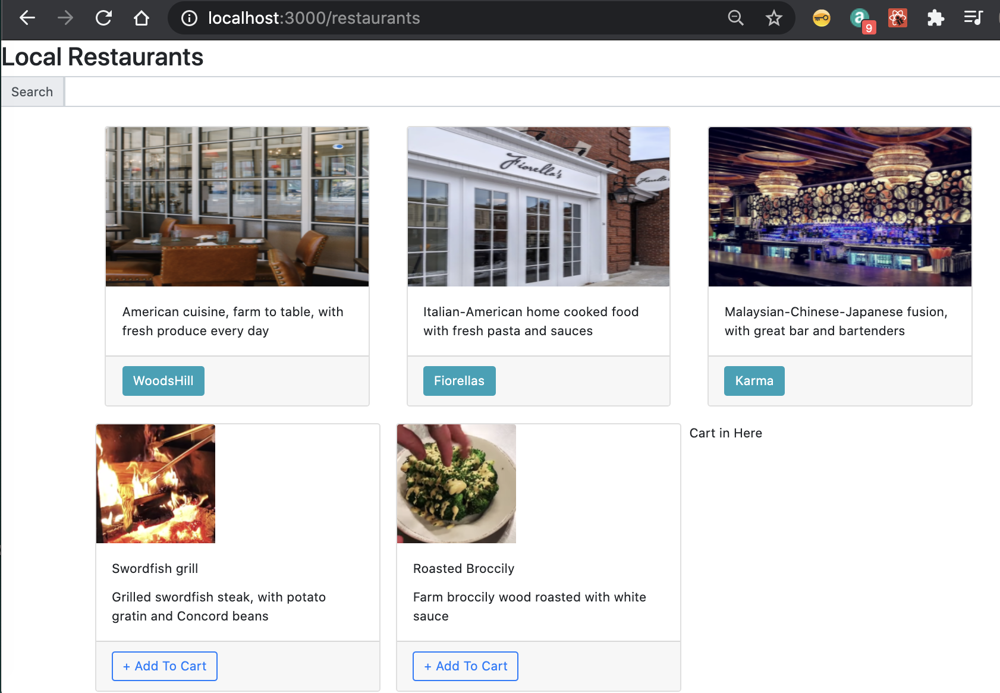

# MITxPRO-Full-Stack Restaurant Application-Capstone

## DESCRIPTION

MITxPRO-Full-Stack Restaurant Application-Capstone is the final project required as part of my learning process as a full stack MERN developer with MITxPR.
The front end is build with React.
This full stack Restaurant application main idea is based on a restaurant search app.

# Next-React Frontend for Restaurants
Exercise03 is full rendering


## use yarn and then yarn dev to run the code

Do NOT do a yarn build since we are not going to deploy it anywhere
Exercise03 is full rendering
index3.js (Data is hardcoded)
index.js (Get data from Strapi using Apollo and GraphQL)
restaurantList.js is Web Component to render restaurants

This is a [Next.js](https://nextjs.org/) project bootstrapped with [`create-next-app`](https://github.com/vercel/next.js/tree/canary/packages/create-next-app).

## Getting Started

First, run the development server:

```bash
npm run dev
# or
yarn dev
```

Open [http://localhost:3000](http://localhost:3000) with your browser to see the result.

You can start editing the page by modifying `pages/index.js`. The page auto-updates as you edit the file.

<!-- Skils -->
### Skills 
<table>
  <tbody>
    <tr>
      <th align="center"></th>
    </tr>
    <tr>
      <td>
        <ul>
          <li>CSS Styles</li>
          <li>CSS bootstrap</li>
          <li>JavaScript</li>
           <li>HTML</li>
           <li>Normalize Style</li>
           <li>Font Awesome</li>
          <li>MongoDB</li>
          <li>Next.js</li>
          <li>Docker</li>
          <li>ReactApp</li>
          <li>Database And API</li>
        </ul>
  <tbody>
<table>

 ## Files 📁
 - Root
   - .next
   - .vscode
   - backend
   - components
   - imageRestaurante
   - node_module
   - out
   - pages
   - public
   - styles
   - gitignore
   - dockerfile
   - lICENSE
   - package-lock.json
   - package.json
   - puppeteer.js
   - README.md
   - server.js


## Learn More

To learn more about Next.js, take a look at the following resources:

- [Next.js Documentation](https://nextjs.org/docs) - learn about Next.js features and API.
- [Learn Next.js](https://nextjs.org/learn) - an interactive Next.js tutorial.

You can check out [the Next.js GitHub repository](https://github.com/vercel/next.js/) - your feedback and contributions are welcome!
  
  ## INSTALLATION GUIDELINES

### _Pre-requisites_


- [Visual Studio](https://visualstudio.microsoft.com/downloads/) (recommended)
- [Git](https://github.com/git-guides/install-git)


### _Installation_

- After you have cloned the project from the repo you need to connect client and server folders from console/command line and run

#### `npm install`

## Deploy on Vercel

The easiest way to deploy your Next.js app is to use the [Vercel Platform](https://vercel.com/import?utm_medium=default-template&filter=next.js&utm_source=create-next-app&utm_campaign=create-next-app-readme) from the creators of Next.js.

Check out our [Next.js deployment documentation](https://nextjs.org/docs/deployment) for more details.
  
## Deploy on AWS
  
### frontend is running on AWS EC2
### backend is running on AWS EC2
### strapi is running on AWS EC2 
### All connected by AWS Route 53 (need to register a domain on AWS Route 53 Hosted zone.)

  
  <!-- Link Live Demo -->
### Link Live Demo
[Live page](http://www.jesse-garciafullstackrestaurantapp.com/)


To install this MITxPRO GitHub page project in your local machine, follow these steps:

1. Download or clone the project from GitHub Repository.
2. Go to content folder and add it to your code editor tool.

   ## MAINTAINERS

This project is maintained by Jesse Garcia. 
  
<!-- LICENSE -->
### Licence 
[](https://opensource.org/licenses/MIT) *The MIT License*

